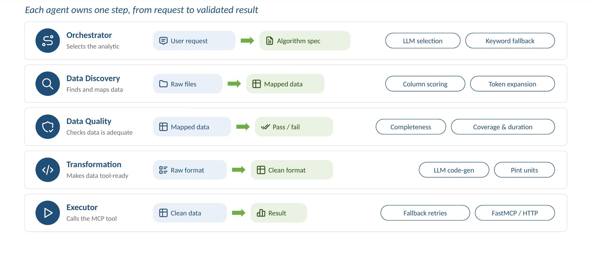
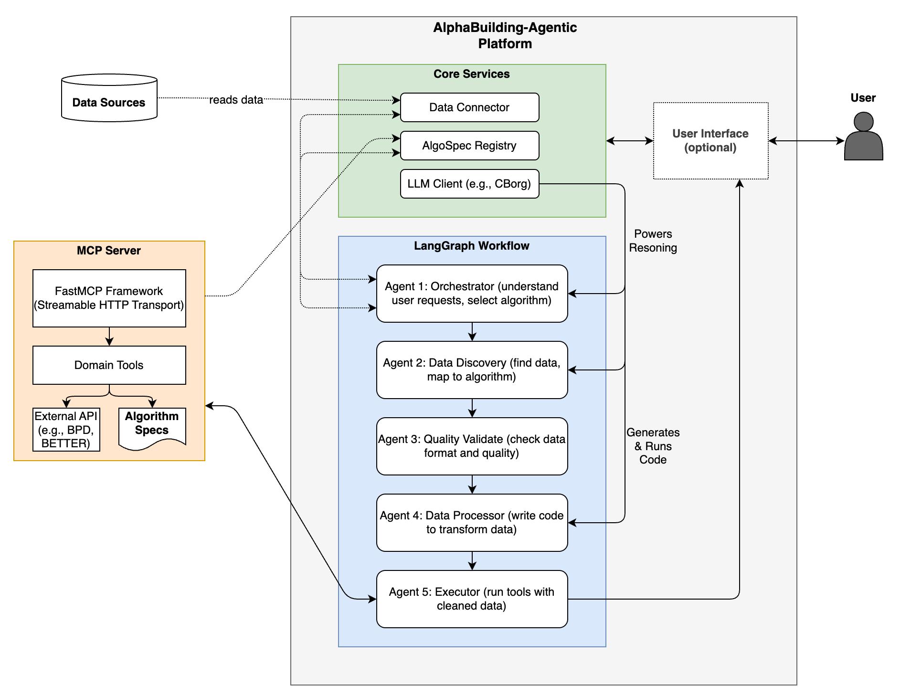
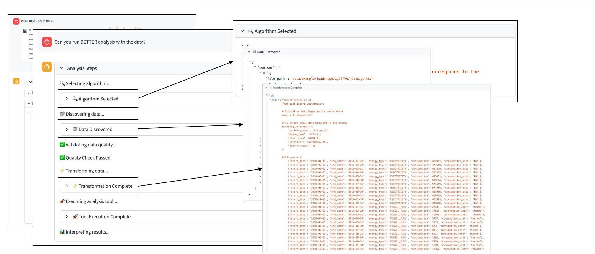
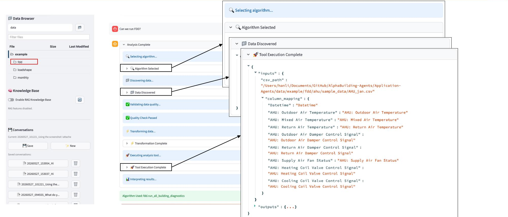

<p align="center">
  
</p>

# 07/15/2026 &mdash; AotW#11: AlphaBuilding &mdash; Multi-Agent Orchestration for Plug-and-Play Building Energy Analytics

---

## Science Story

Commercial and institutional buildings account for a substantial share of U.S. energy consumption, and improving their efficiency is central to DOE's Building Technologies Office mission. Meaningful energy analysis — benchmarking performance against national databases, detecting faults in HVAC systems, forecasting demand, optimizing control setpoints — requires not only the right analytical algorithms but also the ability to find the right input data, validate its quality, transform it into the format the algorithm expects, and interpret the results in building-specific context.

In practice, building analytics tools are powerful but locked behind expert workflows. Each tool has its own data assumptions, units, and column naming conventions; operational data is heterogeneous, split across files, and inconsistently labeled (`OAT` vs `T_oa` vs `OutdoorTemp`); and most analytics ship as scripts or notebooks that assume clean, well-named input data. As a result, operators, auditors, and even researchers cannot pull actionable insights without a domain analyst in the loop — and even well-built analytics stay underused because the path from raw data to validated answer is too narrow.

**AlphaBuilding**, developed at Lawrence Berkeley National Laboratory under the LDRD Autonomous Building Data Infrastructure project, automates this entire workflow. A facility manager types a natural language request — "Analyze the energy performance of Building 12 using BETTER" or "Run fault detection on the AHU" — and the platform returns a structured report with visualizations and interpretations, having autonomously discovered the relevant data files, validated their quality, transformed them to meet algorithm requirements, invoked the appropriate analytics tool via MCP, and interpreted the technical output.

---

## Agentic Motivation

Non-agentic automation fails here for three reasons: there is **no shared contract** (nothing declares which measurements an algorithm needs, for how long, in what units, and what counts as pass or fail), **no data-readiness check** (no consistent way to judge whether data is adequate in coverage, duration, units, gaps, or outliers), and **trial-and-error execution** (a single LLM improvising each run fails on complex tasks and rarely reproduces a result). Notably, MCP standardizes *how a tool is called* — not *what the algorithm needs*. AlphaBuilding closes this gap by pairing agentic orchestration with a declarative data contract:

- **A YAML spec as the contract.** Every analytics algorithm publishes a declarative YAML specification stating its required inputs (with Brick semantics and acceptable units), minimum time-series duration and coverage, preprocessing rules, and pre-execution validation criteria. The spec makes execution reproducible and portable — the spec carries the data contract, MCP carries the request:

  ```yaml
  id: energy.benchmark_eui
  mcp_server: energy_analytics
  mcp_tool: benchmark_with_bpd
  inputs:
    - role: site_energy
      semantics:
        brick_class: "brick:Site_Energy_Sensor"
        units: [kWh, MWh, kBtu]
      timeseries:
        min_duration: "P1Y"
        min_coverage: 0.90
  preprocessing:
    unit_normalization: {energy: kWh, area: sqft}
    aggregation: {method: sum, period: annual}
  validation:
    pre_execution:
      - check: data_completeness
        threshold: 0.85
  ```

- **Five specialized agents, each owning one step from request to validated result**, coordinated by a LangGraph StateGraph over a single shared state that every agent reads and writes:
  - **Orchestrator** — classifies the user request and selects the best-matching algorithm via LLM reasoning over the spec registry, with a keyword-based fallback when LLM uncertainty is high.
  - **Data Discovery** — finds and maps data: scans raw files, uses LLM-powered semantic column matching with confidence scoring and token expansion, and queries a RAG service for building metadata and a SPARQL endpoint for Brick-schema topology.
  - **Data Quality** — checks the discovered data against the spec's thresholds (completeness, time-series coverage and duration) and acts as a conditional gate that either passes the workflow forward or requests human disambiguation.
  - **Data Transformation** — makes data tool-ready by generating Python code for unit conversions (via the Pint library), aggregations, resampling, and schema alignment; the code is validated by AST parsing and forbidden-import checks before sandboxed execution.
  - **Executor** — invokes the selected MCP tool over FastMCP/HTTP with fallback retries, serializing complex data types (Pint Quantities, pandas DataFrames) for transport.

  A report-generation stage then interprets the technical output, extracting key metrics and recommendations in building-domain language and producing a structured report with visualizations.

<p align="center">
  
  <br><em>Figure 1: The five specialized agents — each owns one step, from request to validated result.</em>
</p>

The shared-state (blackboard) pattern means every agent can read what every upstream agent produced, so downstream reasoning is grounded in the full context of the request. Because each agent owns a narrow responsibility, failures are caught where they occur — inadequate data is rejected by the quality gate rather than silently producing a wrong answer.

---

## Implementation

AlphaBuilding is built on **LangGraph 0.2+** and **LangChain 0.3+**, with LLM access provided through the LBNL CBORG API gateway (defaulting to `openai/chatgpt:latest` at temperature 0.0 for reproducibility). A single typed `AnalysisState` flows down the pipeline: each agent reads and writes its own fields, a status field steers the LangGraph conditional edges from one agent to the next, and LangGraph checkpointing persists state across workflow steps so analysis sessions are resumable. Conversation memory feeds recent chat turns into each agent's prompt, and the chosen algorithm is retained so follow-up turns skip re-selection.

<p align="center">
  
  <br><em>Figure 2: Platform architecture — the LangGraph agent workflow, shared core services, and plug-and-play MCP servers.</em>
</p>

Analytics plug in as **MCP servers**: each FastMCP server is self-describing, exposing its domain tools plus a `/specs` endpoint from which the platform's spec registry loads all algorithm specifications into one catalog. Each spec's `mcp_server`/`mcp_tool` fields bind it to the exact call, so **new analytics drop in as YAML with no orchestrator changes**. Current servers cover energy benchmarking (BETTER/BPD), HVAC fault detection, load forecasting, and optimization. The data connectors (RAG, SPARQL, TimeSeries, CSV) are implemented as pluggable adapters, and an **Arize Phoenix** tracing integration provides full observability over every LLM call and agent decision.

The system is served through a **Streamlit** web UI providing chat-based interaction, real-time workflow progress visualization, a data browser, and a RAG knowledge-base selector. The platform has been demonstrated end-to-end on two pilots: **energy analytics** (benchmarking a building's electricity and fossil-fuel use with BETTER from raw monthly bills) and **AHU fault detection** (mapping heterogeneous sensor columns to the FDD algorithm's required points and running whole-building diagnostics).

<table align="center">
  <tr>
    <td align="center" width="50%">
      <br>
      <em>Figure 3a: Energy analytics pilot — BETTER benchmarking from a natural-language request.</em>
    </td>
    <td align="center" width="50%">
      <br>
      <em>Figure 3b: AHU fault detection pilot — automated column mapping and diagnostics.</em>
    </td>
  </tr>
</table>

---

## To Know More

### Source Code
- **Repository:** https://github.com/LBNL-ETA/AlphaBuilding-Agents
- **License:** To be determined (currently an internal LDRD project)

### Additional Resources
- **Presentation:** "Agentic AI Framework for Building Energy Simulation and Operation" (Seminar 19), ASHRAE Annual Conference, Austin, TX, June 2026
- **1-slide summary:** [PDF](images/11-AlphaBuilding/AlphaBuilding-1slide.pdf) · [PNG](images/11-AlphaBuilding/AlphaBuilding-1slide.png)
- **Contact:** Han Li — hanli@lbl.gov
- **Principal Investigator:** Tianzhen Hong — thong@lbl.gov

*This work was supported by the Laboratory Directed Research and Development (LDRD) Program of Lawrence Berkeley National Laboratory, provided by the Director, Office of Science, of the U.S. Department of Energy under Contract No. DE-AC02-05CH11231.*

---

*Last Updated: July 10, 2026*

*Project status: Active Development*

*Contributed by: Han Li, Yujie Xu, Tianzhen Hong (PI) — Lawrence Berkeley National Laboratory, Energy Technologies Area*
