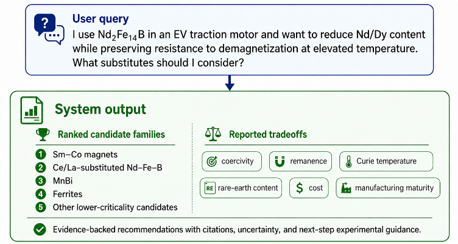
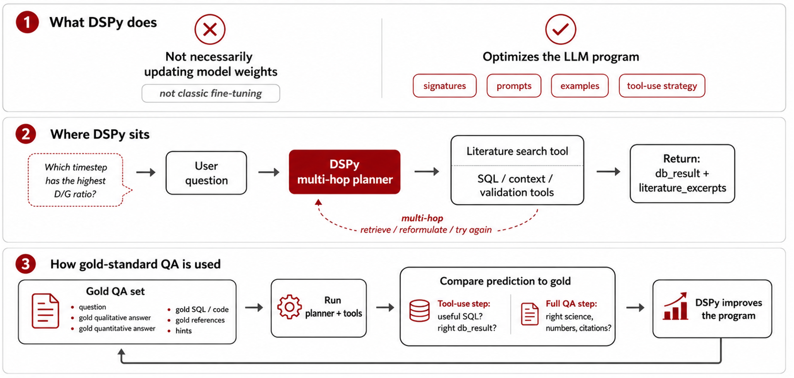
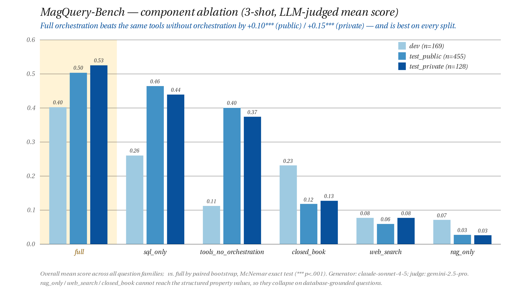
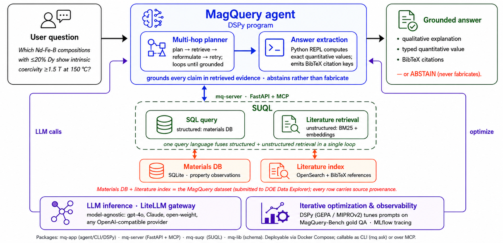
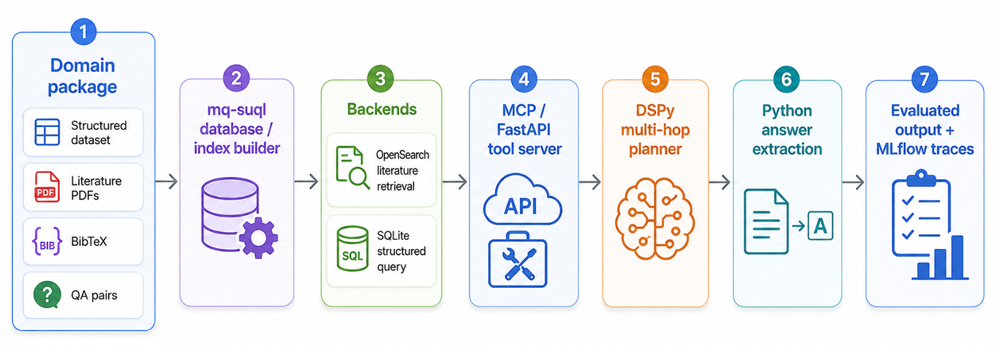

  

# 07/23/2026 &mdash; AotW#12: MagQuery &mdash; Citation-Grounded Question Answering for Magnetic Materials Science

---

## Science Story

Magnetic materials underpin technologies ranging from electric motors and wind turbines to MRI machines and data storage. Engineering next-generation permanent magnets and soft magnetic alloys depends critically on finding and reconciling evidence across a vast, heterogeneous body of experimental literature. A materials scientist asking, "Which bulk Nd-Fe-B compositions with Dy replacing no more than 20% of the Nd sites have a reported intrinsic coercivity of at least 1.5 T at 150 °C?" must navigate hundreds of papers, each with its own notation, reporting conventions, and experimental conditions, before they can form a reliable answer. General-purpose LLMs cannot substitute for this process: they lack access to the specific property measurements, they cannot cite the papers they draw on, and they hallucinate plausible-sounding but unverifiable values.

These are failures of access, not of intelligence. Large language models have become powerful scientific reasoning agents: they can read a technical paper in seconds, reason across a vast literature faster than any human could, and bring together ideas from different fields to produce state-of-the-art responses. But they have no way to reach the data that matters most to a working scientist: the experimental measurements and computational results of the scientist's own research. That is precisely where new science lives, and it is invisible to even the most capable model.

**MagQuery**, developed at Stanford University and SLAC National Accelerator Laboratory under the DOE Genesis Mission CM2US seed model team, makes that data visible. It is a framework that helps LLMs interface with and understand a user's scientific data, connecting the model's reasoning directly to the measurements, simulations, and curated databases of a research group. Ask a question in plain English, and MagQuery brings three strengths together in a single answer: the reasoning power of a modern LLM, evidence gathered from the scientific literature, and the user's own experimental or computational data. Every answer cites the specific papers that support it, and when the evidence is not there, MagQuery says so rather than guessing: no fabricated values, no phantom references. This direct interface to physical, experimental, and computational data is what makes MagQuery unique. It expands a scientist's ability to analyze their own data, answer scientific questions, test hypotheses, and discover new science.

 

  
   <em>Figure 1: An example MagQuery interaction. A plain-English design question returns ranked candidate material families with their reported trade-offs (coercivity, remanence, Curie temperature, rare-earth content, cost, manufacturing maturity), each backed by citations and uncertainty, plus next-step experimental guidance.</em>

 

---

## Agentic Motivation

Scientific question answering over a specialized materials corpus requires capabilities that neither a standard RAG pipeline nor a plain LLM call provides reliably. MagQuery's architecture is motivated by three requirements that drive each design decision:

- **Structured + unstructured retrieval in one loop:** Many materials questions can be partially answered by querying a structured database (exact material compositions, measured property values, provenance metadata) and partially by retrieving free-text explanations from PDFs. MagQuery uses **SUQL** (Structured + Unstructured Query Language) to combine SQL queries over the materials database with embedding-based and BM25 retrieval over the literature corpus within the same multi-hop agent loop. Neither retrieval source alone is sufficient; the agent must learn to use both.
- **Orchestration matters more than tool access:** A rigorous ablation study (6 conditions × 3 shots across MagQuery-Bench, 752 citation-referenced items) isolates the contribution of each component. The key empirical finding: the full orchestration system outperforms simply giving the LLM access to the same tools without structured orchestration by **+0.10 on the public test set and +0.15 on the private test set** — demonstrating that how the agent is instructed to use its tools is as important as which tools it has.
- **Citation grounding as a hard constraint:** The agent is designed to emit bare BibTeX citation keys and never fabricate references. Answers without grounded citations are abstentions. A sandboxed **Python REPL** is available for numerical processing of large result sets (e.g., computing averages across multiple reported measurements), keeping complex post-processing out of the LLM's reasoning chain.
- **DSPy-based prompt optimization:** Rather than hand-engineering prompts, MagQuery uses **DSPy** with the GEPA and MIPROv2 optimizers to systematically improve the prompts of individual agent modules against the MagQuery-Bench development split — making the optimization process itself reproducible and principled.

 

  
   <em>Figure 2: MagQuery's DSPy multi-hop planner. The agent interleaves SQL/context/validation tools with literature search in a multi-hop retrieve → reformulate → try-again loop, then optimizes its prompts (signatures, examples, tool-use strategy) against a gold QA set — turning subjective prompt tweaking into measurable iteration rather than updating any model weights.</em>

 

  
   <em>Figure 3: Component ablation on MagQuery-Bench (752 items, 3-shot, LLM-judged mean score). The full system is best on every split; removing structured orchestration costs +0.10*** (public) / +0.15*** (private), and retrieval-ablated conditions (rag_only, web_search, closed_book) collapse on database-grounded questions.</em>

 

---

## Implementation

MagQuery is organized as four Python packages: `mq-app` (client/agent layer, CLI, DSPy modules, prompt optimization), `mq-server` (FastAPI HTTP API and MCP server exposing tools), `mq-suql` (SUQL integration layer), and `mq-lib` (shared data models and API contract). Literature retrieval is backed by **OpenSearch** with both BM25 and embedding-cosine-similarity search. The materials database is served via SQLite. LLM access is routed through a **LiteLLM proxy** (`mq-litellm`) against the Stanford AI API Gateway, making the system model-agnostic: any OpenAI-API-compatible provider can be substituted.

 

  
   <em>Figure 4: MagQuery architecture. A DSPy multi-hop planner fuses structured SQL over the materials database with literature retrieval (BM25 + embeddings) via SUQL in a single loop, then a Python-REPL answer-extraction step returns a citation-grounded answer — or abstains. Tools are served over mq-server (FastAPI + MCP); the LLM backend is model-agnostic (LiteLLM); prompts are tuned with DSPy and traced with MLflow. The materials database and literature index together form the MagQuery dataset, with full source provenance.</em>

 

The agent exposes both a CLI (`mq ask`) and an **MCP server**, enabling integration into broader agentic workflows. DSPy optimization (`mq train`) produces optimized-prompt artifacts stored separately from code — no model weights are trained or redistributed. The full stack is deployable via Docker Compose. The evaluation benchmark **MagQuery-Bench** (752 items, `dev`/`test_public`/`test_private` splits) provides a reproducible evaluation substrate with citation-grounded scoring by an LLM judge.

 

  
   <em>Figure 5: Build-and-serve pipeline. A domain package (structured dataset, literature PDFs, BibTeX, QA pairs) is indexed by <code>mq-suql</code> into SQLite and OpenSearch backends, exposed through an MCP/FastAPI tool server, and consumed by the DSPy multi-hop planner and Python answer extraction — producing evaluated output with MLflow traces.</em>

 

---

## To Know More

### Source Code
- **Repository:** Contact authors (DOE CODE/OSTI submission pending)
- **License:** Apache 2.0

### Related Publication
MagQuery is founded on similar retrieval-and-reasoning architecture previously demonstrated for battery science in:

- Vangara, S.; Nanda, J.; Tzeng, Y.-K.; Darve, E. *SpectraQuery: A Hybrid Retrieval-Augmented Conversational Assistant for Battery Science.* arXiv:2601.09036 (2026). [doi:10.48550/arXiv.2601.09036](https://doi.org/10.48550/arXiv.2601.09036)

### Additional Resources
- **MagQuery dataset:** sibling DOE Data Explorer submission (BibTeX-indexed literature + property database)
- **Contact:** Johannes Voss — vossj@slac.stanford.edu, SLAC National Accelerator Laboratory (ORCID: 0000-0001-7740-8811)
- **Contact:** Sreya Vangara — svangara@stanford.edu, Stanford University (ORCID: 0000-0002-4762-8773)
- **Contact:** Eric Darve (PI) — darve@stanford.edu, Stanford University (ORCID: 0000-0002-1938-3836)

---

*Last Updated: July 23, 2026*
*Contributed by: Sreya Vangara, Jonathan Thompson, Eric Darve (PI) — Stanford University; Johannes Voss — SLAC National Accelerator Laboratory*
