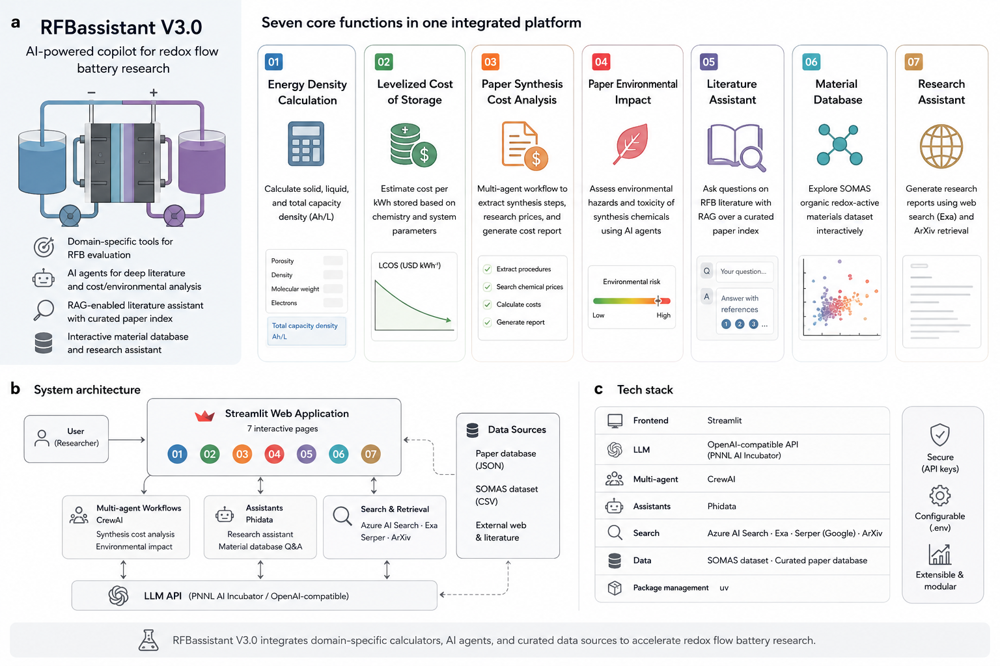

  

# [Date] &mdash; AotW#[Number]: RFB Research Assistant &mdash; Agentic Literature Intelligence for Redox Flow Battery Research

---

## Science Story

Redox flow batteries (RFBs) are a leading technology for grid-scale energy storage — a critical enabler of affordable and reliable power supply and a central priority for DOE's Energy Storage Grand Challenge. The RFB research literature spans electrolyte chemistry, electrode materials, membrane design, system engineering, and techno-economic analysis, and is growing rapidly. Keeping current across this breadth is increasingly difficult: a researcher seeking to understand the redox potential of a specific organic molecule, compare cycling stability across electrolyte classes, or identify gaps in the published optimization landscape must navigate thousands of papers before they can form a research hypothesis or design an experiment.

The **RFB Research Assistant**, developed at Pacific Northwest National Laboratory's Energy Storage Materials Initiative (ESMI), addresses this challenge through two complementary AI-powered capabilities: an automated **research workflow** that generates comprehensive literature reports from a single topic description, and a **Literature Q&A assistant** that answers precise technical questions using retrieval-augmented generation (RAG) over a curated RFB document corpus. Together, they allow a researcher to go from question to literature-grounded answer in minutes rather than hours.

 

  
   
  <em>Figure 1: The RFB Research Assistant. (a) Seven functions spanning domain calculators, multi-agent synthesis cost and environmental impact analysis, retrieval-augmented literature question answering, interactive materials database exploration, and automated research reporting. (b) System architecture, showing the Streamlit frontend, the CrewAI and Phidata agent layers, the retrieval services, and the curated data sources behind them. (c) Software stack.</em>

---

## Agentic Motivation

Literature intelligence for a specialized scientific domain requires more than a general-purpose search engine. The RFB Research Assistant is organized as two distinct agent pipelines, each optimized for a different research need:

**Research Workflow** — for open-ended exploration:
- **Search Term Generator:** Uses an LLM to expand a natural language research topic into a set of optimized, diverse search queries — addressing the vocabulary mismatch between how researchers describe ideas and how papers are indexed.
- **Exa Web Search + ArXiv Search (parallel):** Two independent search agents hit different source types simultaneously — Exa's neural web search for recent content and preprints, ArXiv's API (with PDF reading) for academic depth — providing complementary coverage.
- **Research Editor:** Synthesizes the combined search results into a streaming, coherent markdown report with properly attributed claims. The editor is grounded in retrieved content rather than parametric memory, reducing hallucination risk.

**Literature Q&A** — for precise technical questions:
- **Azure AI Search (hybrid retrieval):** Combines keyword search and vector similarity search (text-embedding-3-small) over the indexed RFB corpus, returning the top-3 most relevant chunks with source titles.
- **GPT answer generation:** Generates technically precise answers grounded exclusively in the retrieved context, with explicit LaTeX equation support for electrochemical content and mandatory source citation — enabling a researcher to verify every claim against the original paper.

The two-pipeline design reflects a key design principle: open-ended exploration and precise technical lookup require different retrieval and generation strategies, and conflating them produces mediocre performance on both tasks.

---

## Implementation

The Research Workflow is built on **Phidata** assistants orchestrated sequentially. The Literature Q&A is powered by **Azure AI Search** (hybrid retrieval with `VectorizableTextQuery`) and **Azure OpenAI GPT** for answer generation. Both components are served through independent **Streamlit** web applications. The underlying RFB literature corpus is indexed in Azure AI Search with vector embeddings (dimension 1024); the index schema stores chunk text, chunk ID, parent document ID, and title, enabling per-answer source attribution.

The system has been described in a peer-reviewed publication:

> Feng, Liang, Yin, Gao, Wang — *Agentic Assistant for Materials Scientists*, The Electrochemical Society Interface, 34(2):45 (2025). [doi:10.1149/2.F09252IF](https://doi.org/10.1149/2.F09252IF)

---

## To Know More

### Source Code
- **Repository:** https://gitlab.pnnl.gov/RFB/rfb_assistant_v3
- **License:** MIT

### Additional Resources
- **Paper:** https://doi.org/10.1149/2.F09252IF
- **Contact:** Ruozhu Feng — ruozhu.feng@pnnl.gov

---

*Last Updated: [Date]*
*Contributed by: Ruozhu Feng — Pacific Northwest National Laboratory, Energy Storage Materials Initiative*
