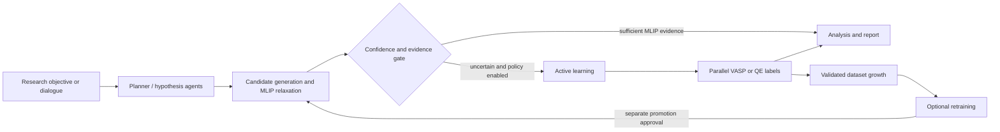

  

# 10/01/2026 &mdash; AotW#15: matsim-agents &mdash; Agentic Atomistic Materials Discovery with Machine-Learned Interatomic Potentials

---

## Science Story

Discovering functional materials requires navigating compositional and structural
spaces that are too large to screen exhaustively with density functional theory
(DFT). Machine-learned interatomic potentials (MLIPs) can accelerate energy, force,
and relaxation calculations, but an out-of-distribution surrogate prediction can
misdirect a campaign unless the workflow recognizes uncertainty and requests
higher-fidelity evidence.

**matsim-agents**, developed at Oak Ridge National Laboratory by the ModCon Seed Team
Critical Minerals and Materials to Unlock Supply (CM2US), connects scientific reasoning to atomistic computation. A
researcher can state an objective in natural language; agents then plan calculations,
generate candidate crystal structures, relax them with a selected MLIP, assess
convergence and stability, and preserve the evidence behind each decision. When a
HydraGNN calculation has low branch-weight confidence, a configurable policy can
handoff the case to active learning for DFT labeling. The same scientific workflows
run on laptops and on Frontier, Aurora, and Perlmutter.

---

## Agentic Motivation

Atomistic materials discovery is a sequence of evidence-dependent decisions rather
than a single model call. matsim-agents uses agents to coordinate that sequence while
keeping numerical claims tied to calculations:

- **Multiple interaction modes:** The core run graph executes focused objectives
  through planner, executor, uncertainty-gate, and analyst nodes. Discovery chat
  supports iterative hypothesis generation and can launch atomistic exploration when
  a composition is detected. The supervisor graph automates composition and phase
  exploration. The active-learning workflow performs sampling, acquisition, DFT
  labeling, dataset growth, and optional retraining.
- **Uncertainty-gated escalation:** For HydraGNN, branch-weight statistics provide a
  configurable confidence heuristic. The orchestration layer records the measured
  values and thresholds, then either continues with MLIP-level evidence or initiates
  an active-learning handoff. Other MLIP backends remain usable, but do not claim this
  HydraGNN-specific uncertainty signal.
- **Explicit scientific evidence levels:** LLM proposals remain hypotheses; MLIP
  predictions, DFT calculations, and experiments are represented as different levels
  of evidence. Unconverged calculations are retained with failure reasons and excluded
  from rankings rather than silently discarded.
- **Guarded active learning:** DFT labeling, model retraining, and model promotion are
  independent decisions. Retraining is optional, and a newly trained model cannot
  drive the next iteration without separate approval after validation.
- **Auditable, restartable campaigns:** Resolved configuration, provenance, event
  streams, structures, calculations, datasets, models, and results are written to
  collision-resistant run directories. This makes routing and escalation decisions
  inspectable after a local or HPC run.

---

## Implementation

matsim-agents is a Python framework built around **LangGraph** orchestration and
**ASE** atomistic interfaces. Its composable workflow hierarchy covers structure
relaxation, active learning, composition and phase exploration, property-driven
investigation, and multi-model scientific debate.

Candidate structures are generated from the pymatgen AFLOW prototype encyclopedia
and optional PyXtal random symmetry-aware sampling. Geometry relaxation supports
HydraGNN, UMA through FairChem, and MACE-family models through a common MLIP-facing
workflow. Relative phase ranking compares converged candidates within an exploration;
convex-hull claims additionally require compatible elemental and competing-phase
references. DFT labeling is available through VASP 6.6 or Quantum ESPRESSO `pw.x`.

LLM access is provider-agnostic, with adapters for Ollama, vLLM and other
OpenAI-compatible endpoints, Anthropic, and Hugging Face. Scientific debate runs
preserve the complete ordered transcript and independent model verdicts; statements
remain hypothesis-level evidence until calculations or experiments support them.

Facility-specific environments and launchers support **Frontier** (AMD MI250X),
**Aurora** (Intel Data Center GPU Max), and **Perlmutter** (NVIDIA A100). The Python/ML
and DFT software stacks are deliberately isolated and coupled through scheduler steps
and persisted files, avoiding accelerator-toolchain conflicts while retaining a common
scientific interface.

The open-source `v1.0` release was published through DOE CODE/OSTI on May 16,
2026. Development continues beyond that tagged release, including broader MLIP model
support, scientific campaign orchestration, and cross-facility qualification.

---

## To Know More

### Source Code

- **Repository:** https://github.com/ORNL/matsim-agents
- **Documentation:** https://github.com/ORNL/matsim-agents#readme
- **v1.0 release:** https://github.com/ORNL/matsim-agents/releases/tag/v1.0
- **DOE CODE record:** https://www.osti.gov/doecode/biblio/181158
- **Official DOI:** https://doi.org/10.11578/dc.20260516.1
- **License:** BSD-3-Clause

### Additional Resources

- **HydraGNN repository:** https://github.com/ORNL/HydraGNN
- **HydraGNN predictive GFM dataset:**
  https://doi.org/10.13139/OLCF/2562660
- **Related preprint:** https://arxiv.org/abs/2604.15380
- **Contact:** Massimiliano Lupo Pasini &mdash; lupopasinim@ornl.gov

---

*Last Updated: September 29, 2026*  
*Contributed by: ModCon Seed Team Critical Minerals and Materials to Unlock Supply (CM2US) and ORNL HydraGNN Development Team &mdash; Oak Ridge National Laboratory*